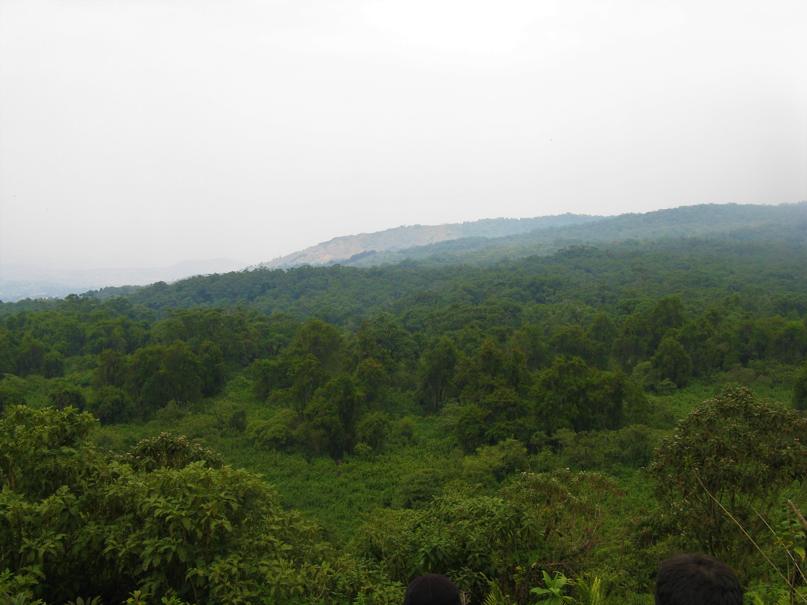

# I am a transdisciplinary biologist and primatologist working at the intersection of evolutionary theory and conservation practice.
### My work is driven by two primary research programs:
#### Primate Behavioral Ecology: I investigate how primates navigate the fundamental trade-offs between their physical environments and their social worlds to answer why we see the breadth of behavioral and functional diversity present today.
#### Applied Conservation & Capacity Building: I study how to build more effective, equitable frameworks for conservation decision-making. This includes researching inclusive pedagogy and mentorship models that support the next generation of scientists and ensure that conservation efforts are both socially just and professionally sustainable. I am currently a postdoctoral researcher on a multi-institution project investigating co-production in land-use modeling and planning for conservation action at Arizona State University. ​

- [Curriculum Vitae](https://docs.google.com/document/d/1-S1wAjFTLDg2I6XGEgBMf6XPyeSB5ZHV/export?format=pdf)
- [Google Scholar](https://scholar.google.com/citations?user=acyralEAAAAJ&hl=en)
- [LinkedIn](https://www.linkedin.com/in/caitlin-hawley-91002b209/)
- [DISES Project](https://dises-ci-ucsb.github.io/dises-web/)
- crhawley@asu.edu

